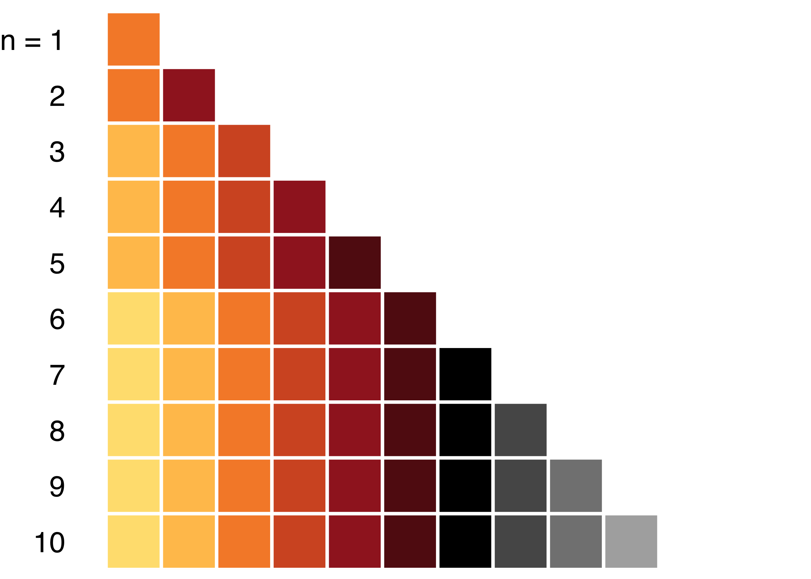

<!-- README.md is generated from README.Rmd. Please edit that file -->

# grattantheme

Create ggplot2 charts in the Grattan Institute style.

See the [grattantheme
vignette](https://github.com/grattan/grattantheme/blob/master/vignettes/using_grattantheme.pdf)
to learn how to make your ggplot2 charts Grattan-y.

## Install grattantheme

The grattantheme package needs to be downloaded and installed from
Github. The easiest way to do this is with the devtools package. If you
don’t have the devtools package, install it:

`install.packages("devtools")`

Once devtools is installed, you can download and install grattantheme as
follows:

`devtools::install_github("grattan/grattantheme", dependencies = TRUE,
upgrade = "always")`

Once grattantheme is installed, you can load it the same way you
normally load an R package:

`library(grattantheme)`

## Make your charts look nice

See the [grattantheme
vignette](https://github.com/grattan/grattantheme/blob/master/vignettes/using_grattantheme.pdf)
for a more complete guide.

Use `theme_grattan()` to format your ggplot2 charts in a style
consistent with the Grattan style guide, including elements such as
gridline colours and line width, font size, etc. For scatter plots,
`theme_grattan(chart_type = "scatter")` provides a black y-axis.

Use `grattan_y_continuous()` to set default values for your vertical
axis that will work well with most Grattan charts.

Use `grattan_colour_manual(n)` or `grattan_fill_manual(n)` to format the
`n` coloured elements of your `ggplot2` plot. These functions will
choose appropriately-spaced Grattan colours, ordered from either light
to dark or the reverse.

The colours that will be used in your plot are:

A range of colours from the style guide (such as `grattan_lightorange`,
`grattan_red`, and so on) are defined for your convenience.

## Save your nice looking charts

Use `grattan_save()` to save your ggplot2 charts (eg. as `.png` or
`.pdf` files) for use elsewhere, such as in Powerpoint, LaTeX, or the
Grattan Blog, with the size and resolution set to style guide-consistent
values. You can save your charts in a variety of sizes and styles (see
`?grattan_save()` for a list).

Use `make_slide()` and `make_presentation()` to create Powerpoint
presentations from your chart(s), including editable titles and
subtitles.

Use `save_chartdata()` to save your chart and accompanying data as a
properly-formatted .xlsx workbook.

## Save animated charts

Use `grattan_anim_save()` to save gganimate animations formatted in the
Grattan style.

## Notes

Some graph defaults (such as colour) will be modified during your R
session; restart R to restore all defaults.

Please note that some manual modification to your chart will most likely
be required in order to make it fully consistent with the style guide,
just as it would in other visualisation software or Excel/Powerpoint.
